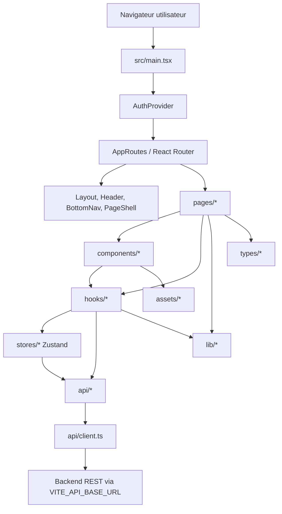
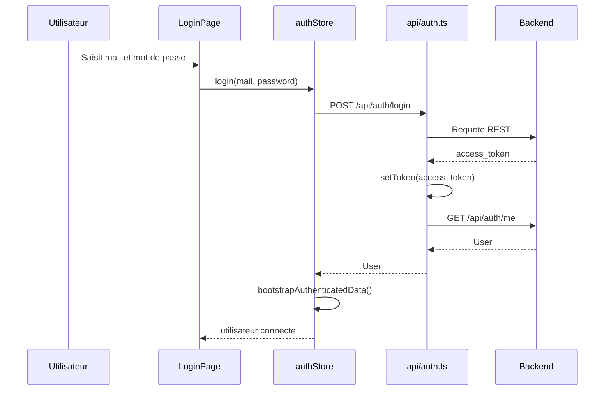

# Documentation technique front

## 1. Perimetre

Cette documentation decrit la partie front de l'application Michelin Ride Companion. Le front est une single page application React orientee mobile, construite avec Vite, TypeScript, Tailwind CSS v4 et React Router.

L'application couvre les parcours suivants :

- authentification et inscription utilisateur ;
- tableau de bord utilisateur ;
- recherche et ajout de pneus ;
- suivi d'usure des pneus utilisateur ;
- suivi d'activites velo, avec integration Strava et enregistrement GPS local ;
- consultation de revendeurs et carte Leaflet ;
- alertes, communaute, guide, evenements, recompenses et parrainage ;
- recommandation de pneus via une API IA.

## 2. Stack technique

| Usage | Technologie |
| --- | --- |
| Framework UI | React 19 |
| Langage | TypeScript |
| Bundler / dev server | Vite |
| Routing | react-router-dom |
| Etat global | Zustand |
| Styling | Tailwind CSS v4 |
| Icones | lucide-react et assets SVG locaux |
| Cartographie | Leaflet, react-leaflet, OpenStreetMap |
| Packaging production | Docker multi-stage, Nginx statique |

Scripts disponibles :

```bash
npm run dev
npm run build
npm run lint
npm run preview
```

## 3. Vue d'ensemble de l'architecture

Le front suit une architecture par couches :



Les principes principaux sont :

- `src/main.tsx` monte l'application React et installe le `AuthProvider`.
- `src/App.tsx` centralise le routage et la protection des pages authentifiees.
- `src/components/layout` fournit la structure commune de navigation.
- `src/pages` contient les ecrans metier.
- `src/components` contient les composants reutilisables, classes par domaine.
- `src/hooks` encapsule les chargements de donnees, etats locaux complexes et effets navigateur.
- `src/stores` contient les etats globaux partages avec Zustand.
- `src/api` contient des wrappers REST types autour du client HTTP commun.
- `src/lib` contient les fonctions pures ou utilitaires metier.
- `src/types` centralise les types TypeScript des domaines fonctionnels.

## 4. Structure des dossiers

```text
src/
  api/              Appels REST types par domaine
  assets/           Images et SVG utilises par l'interface
  components/       Composants UI, layout et composants metier
  contexts/         Contexte d'initialisation auth
  hooks/            Hooks React pour donnees et logique applicative
  lib/              Helpers metier, formatage, calculs, stockage local
  pages/            Pages routees par React Router
  stores/           Stores Zustand globaux
  types/            Definitions TypeScript partagees
  App.tsx           Routes de l'application
  main.tsx          Point d'entree React
  index.css         Import Tailwind et tokens de design
```

Le fichier `src/App.css` est present mais n'est pas importe par l'application actuelle. Les styles actifs viennent principalement de Tailwind et de `src/index.css`.

## 5. Routage

Le routage est declare dans `src/App.tsx` avec `BrowserRouter`, `Routes` et `Route`.

| Route | Page | Protection |
| --- | --- | --- |
| `/` | `HomePage` ou redirection dashboard | publique, redirige si connecte |
| `/login` | `LoginPage` | publique |
| `/register` | `RegisterPage` | publique |
| `/dashboard` | `DashboardPage` | authentifiee |
| `/trouver-pneu` | `FindTirePage` | authentifiee |
| `/mes-pneus` | `MyTiresPage` | authentifiee |
| `/suivi-pneu/:tireId` | `TireTrackingPage` | authentifiee |
| `/activites` | `ActivitiesPage` | authentifiee |
| `/activites/:id` | `ActivityPage` | authentifiee |
| `/retailers` | `RetailersPage` | authentifiee |
| `/settings` | `SettingsPage` | authentifiee |
| `/communaute` | `CommunautePage` | authentifiee |
| `/recompenses` | `RecompensesPage` | authentifiee |
| `/parrainage` | `ParrainagePage` | authentifiee |
| `/evenements` | `EvenementsPage` | authentifiee |
| `/guide` | `GuidePage` | authentifiee |
| `/remplacement` | `RecommendationModal` | authentifiee |

`RequireAuth` lit l'etat auth via `useAuth()` et redirige vers `/login` si l'utilisateur n'est pas authentifie. Pendant l'initialisation, il affiche un etat de chargement.

## 6. Authentification

L'authentification est pilotee par `src/stores/authStore.ts` et exposee via `src/contexts/AuthContext.tsx`.

Cycle de demarrage :

1. `main.tsx` rend `<AuthProvider><App /></AuthProvider>`.
2. `AuthProvider` appelle `useAuthStore.getState().initialize()`.
3. Le store verifie la presence du token `access_token` dans `localStorage`.
4. Si un token existe, le front appelle `/api/auth/me`.
5. Si l'utilisateur est valide, les donnees partagees sont chargees via `bootstrapAuthenticatedData()`.
6. En cas d'echec, le token est supprime et les stores metier sont reinitialises.

Le token est ajoute automatiquement aux requetes dans `src/api/client.ts` via le header `Authorization: Bearer <token>`.

## 7. Couche API

La couche API repose sur `src/api/client.ts`.

Responsabilites du client commun :

- lire `VITE_API_BASE_URL` ;
- prefixer les chemins API avec l'URL backend ;
- ajouter `Content-Type: application/json` lorsqu'un body est present ;
- ajouter le token Bearer si disponible ;
- gerer les reponses `204` ;
- convertir les erreurs HTTP en `ApiError` ;
- supporter un timeout optionnel avec `AbortController`.

Les modules API sont organises par domaine :

| Fichier | Domaine | Exemples d'endpoints |
| --- | --- | --- |
| `api/auth.ts` | Auth, utilisateur, Strava | `/api/auth/login`, `/api/auth/me`, `/api/auth/strava/connect` |
| `api/tires.ts` | Catalogue pneus et pneus utilisateur | `/api/tires/catalog/search`, `/api/tires/mine`, `/api/tires/model/:id` |
| `api/activities.ts` | Activites et points GPS | `/api/activities`, `/api/activities/start`, `/api/activities/:id/points` |
| `api/alerts.ts` | Alertes | `/api/alerts`, `/api/alerts/:id` |
| `api/ai.ts` | Recommendation IA | `/api/ai/tires/recommend` |
| `api/rewards.ts` | Recompenses | `/api/rewards/me`, `/api/rewards/:id/use` |
| `api/referrals.ts` | Parrainage | `/api/referrals/me`, `/api/referrals/validate/:code` |
| `api/influencer.ts` | Dashboard influenceur | `/api/influencer/dashboard` |
| `api/retails.ts` | Retails | `/api/retails` |

## 8. Gestion d'etat

L'application combine trois niveaux d'etat :

| Niveau | Usage |
| --- | --- |
| Etat local React | formulaires, modales, chargements ponctuels |
| Hooks personnalises | orchestration de donnees et effets navigateur |
| Stores Zustand | donnees partagees et caches globaux |

Stores principaux :

- `authStore` : utilisateur courant, login, register, refresh, logout.
- `activitiesStore` : liste des activites, cache de 30 secondes, reset.
- `userTiresStore` : pneus utilisateur, pneus actifs, cache de 30 secondes, reset.
- `alertsStore` : alertes, modal d'alertes, marquage comme lu.

`src/stores/index.ts` centralise les operations transverses :

- `bootstrapAuthenticatedData()` charge activites, pneus et alertes apres connexion.
- `resetAllStores()` vide les stores metier au logout.
- `invalidateAfterActivityChange()` recharge les donnees impactees apres une activite.

## 9. Hooks metier

Les hooks isolent la logique d'ecran pour garder les composants plus lisibles.

Exemples :

- `useActivities` lit le store d'activites et declenche le chargement.
- `useActivity` charge le detail d'une activite.
- `useActivityRecording` gere l'enregistrement GPS, les phases de pause/reprise/fin, les calculs de distance et la persistance locale.
- `useUserTires`, `useUserTireInfo`, `useUserTireWear` encapsulent les donnees pneus utilisateur.
- `useTireModelDetail`, `useTyreDealers` chargent les details catalogue et revendeurs.
- `useRewards`, `useReferrals`, `useInfluencerDashboard` servent les parcours fidelite.

## 10. Flux fonctionnels majeurs

### Connexion



### Suivi d'activite GPS

`useActivityRecording` gere le suivi local :

- verification de l'activite backend en cours ;
- reprise eventuelle d'un enregistrement depuis `localStorage` ;
- demarrage d'un timer local ;
- surveillance GPS via `navigator.geolocation.watchPosition` ;
- calcul de distance avec la formule de Haversine ;
- calcul de vitesse et denivele ;
- envoi periodique des points GPS toutes les 5 secondes ;
- pause, reprise, fin ou suppression d'activite ;
- invalidation des caches activites, alertes et pneus en fin de parcours.

### Recherche et suivi de pneus

Le domaine pneus s'appuie sur :

- recherche catalogue via `/api/tires/catalog/search?q=...` ;
- ajout d'un modele au compte via `/api/tires/mine` ;
- suivi d'usure via `/api/tires/mine/:id/wear` ;
- informations detaillees via `/api/tires/mine/:id/info` ;
- activation/desactivation d'un pneu via `/api/tires/mine/:id/active` ;
- suppression via `DELETE /api/tires/mine/:id`.

### Revendeurs et cartographie

La carte des revendeurs utilise `react-leaflet` et `leaflet` :

- centre par defaut sur la France ;
- centrage dynamique sur les revendeurs et/ou la position utilisateur ;
- fond OpenStreetMap ;
- marqueurs personnalises via `L.divIcon`.

La geolocalisation utilisateur est demandee dans les composants de dealers, puis les revendeurs peuvent etre tries par distance avec `src/lib/dealer-geo.ts`.

## 11. Design system front

Le design est base sur Tailwind CSS v4.

`src/index.css` declare :

- les tokens couleurs Michelin ;
- les couleurs fonctionnelles ;
- les couleurs applicatives (`app-bg`, `surface`, `border-subtle`) ;
- quelques utilitaires (`ease-spring`, `icon-active`, `icon-inactive`, `scrollbar-hide`).

Les composants UI generiques sont dans `src/components/ui` :

- `Card`
- `Chip`
- `CopyField`
- `EmptyState`
- `ErrorAlert`
- `HorizontalSlider`
- `LoadingMessage`
- `ModalPortal`
- `ProgressBar`
- `SectionBlock`
- `SectionHeader`
- `StatCard`

L'application est concue mobile-first. `Layout` contraint la largeur principale et `BottomNav` fournit la navigation principale en bas de l'ecran.

## 12. Configuration et environnements

Variable d'environnement :

```bash
VITE_API_BASE_URL=http://localhost:3000
```

Cette variable est lue par Vite au build. En production, elle doit donc etre injectee pendant la construction de l'image ou du bundle.

Fichiers associes :

- `.env.example` : exemple de configuration locale ;
- `vite.config.ts` : plugins React et Tailwind ;
- `tsconfig.app.json` : configuration TypeScript stricte pour le code front.

## 13. Build et deploiement

Le build local :

```bash
npm run build
```

Le Dockerfile utilise deux etapes :

1. `node:22-alpine` installe les dependances avec `npm ci` et genere `dist` avec `npm run build`.
2. `nginx:1.27-alpine` sert les fichiers statiques depuis `/usr/share/nginx/html`.

La configuration Nginx active le fallback SPA :

```nginx
try_files $uri $uri/ /index.html;
```

Cela permet aux routes React comme `/dashboard` ou `/activites/:id` de fonctionner apres rafraichissement navigateur.

## 14. Qualite et verification

Commandes de verification disponibles :

```bash
npm run lint
npm run build
```
